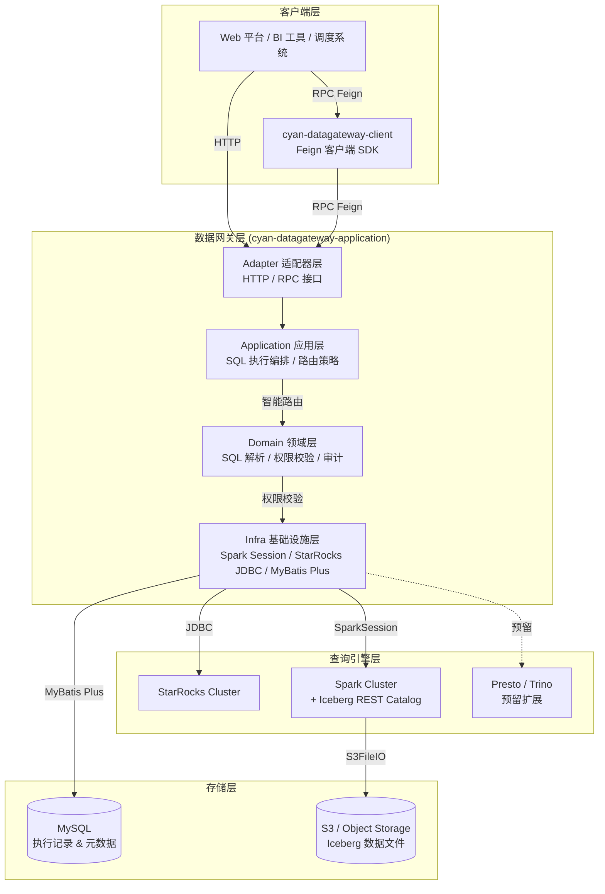

# cyan-datagateway

<p align="center">
  
  
  
  
  
  
  
</p>

**cyan-datagateway** 是 Cyan 数据平台的核心数据网关服务，提供 **StarRocks / Spark SQL / Flink** 等多引擎统一的 SQL 执行入口。通过智能路由与动态资源分配，实现异构查询引擎的透明化调用、SQL 执行全链路审计以及精细化数据权限管控。

---

## 📋 目录

- [项目简介](#-项目简介)
- [架构图](#-架构图)
- [模块说明](#-模块说明)
- [技术栈](#-技术栈)
- [核心功能](#-核心功能)
- [快速开始](#-快速开始)
- [API 接口](#-api-接口)
- [配置说明](#-配置说明)
- [数据库初始化](#-数据库初始化)

---

## 🚀 项目简介

在大数据平台中，不同业务场景对查询引擎有着差异化需求：

| 场景 | 推荐引擎 | 特点 |
|------|---------|------|
| OLAP 实时分析 | StarRocks | 高并发、低延迟 |
| 离线批处理 / 湖仓查询 | Spark SQL | 生态丰富、兼容 Iceberg |
| 交互式即席查询 | Presto / Trino | 联邦查询、跨源分析 |

**cyan-datagateway** 将这些引擎的能力统一封装为标准化服务，上层业务无需关心底层引擎差异，仅需通过统一 API 或 Feign 客户端提交 SQL，即可由网关完成：**引擎智能路由 → 资源动态分配 → SQL 安全执行 → 结果返回 → 执行记录审计** 的完整闭环。

---

## 🏗 架构图



---

## 📦 模块说明

```
cyan-datagateway/
├── pom.xml                                          # 父 POM，统一管理依赖版本
├── cyan-datagateway-client/                         # 客户端模块（零依赖，可被任意服务引用）
│   ├── SqlGatewayClient.java                        # Feign RPC 客户端接口
│   ├── cmd/SqlExecuteCmd.java                       # SQL 执行命令 DTO
│   ├── dto/SqlExecuteResultDTO.java                 # SQL 执行结果 DTO
│   └── enums/                                       # 枚举定义（引擎类型 / SQL 类型 / 执行状态）
│       ├── QueryEngineType.java                     # STARROCKS / SPARK / PRESTO / TRINO
│       ├── SqlType.java                             # SELECT / INSERT / UPDATE / DELETE
│       └── SqlExecuteStatus.java                    # SUCCESS / FAILED / RUNNING
│
└── cyan-datagateway-application/                    # 应用主模块（Spring Boot 可执行服务）
    ├── adapter/                                     # 适配器层（对外暴露 HTTP / RPC）
    │   ├── sql/http/                                # HTTP REST 接口（面向 Web / BI）
    │   │   ├── SparkSqlController.java
    │   │   ├── StarRocksSqlController.java
    │   │   └── dto/                                 # HTTP 请求 / 响应 DTO
    │   └── sql/rpc/                                 # RPC 接口（面向内部微服务 Feign 调用）
    │       └── SqlGatewayRPC.java
    ├── application/                                 # 应用服务层（用例编排、事务控制）
    │   ├── sql/SparkSqlService.java                 # Spark SQL 执行服务
    │   ├── sql/SqlExecuteService.java               # 通用 SQL 执行服务
    │   └── sql/impl/                                # 服务实现
    ├── domain/                                      # 领域层（核心业务逻辑、充血模型）
    │   └── sql/
    │       ├── SqlExecuteRecord.java                # SQL 执行记录领域对象
    │       ├── query/SqlExecuteRecordQuery.java     # 查询条件值对象
    │       └── repository/                          # 领域仓库接口
    └── infra/                                       # 基础设施层（技术实现细节）
        ├── config/                                  # 配置类
        │   ├── SparkConfig.java                     # SparkSession + Iceberg Catalog 配置
        │   ├── StarRocksProperties.java             # StarRocks JDBC 配置
        │   └── MybatisConfig.java                   # MyBatis Plus 配置
        ├── persistence/                             # 数据持久化
        │   └── sql/
        │       ├── dos/SqlExecuteRecordDO.java      # 数据库对象
        │       ├── mappers/SqlExecuteRecordMapper.java
        │       └── repository/SqlExecuteRecordRepositoryImpl.java
        └── util/                                    # 工具类
            ├── SparkSqlUtil.java
            └── StarRocksUtil.java
```

---

## 🛠 技术栈

| 技术 | 版本 | 用途 |
|------|------|------|
| Java | 21 | 开发语言 |
| Spring Boot | 3.3.13 | Web 容器 & 自动配置 |
| Spring Cloud OpenFeign | — | 微服务间 RPC 通信 |
| Apache Spark | 4.0.2 | 离线批处理 / 湖仓 SQL 执行 |
| Scala | 2.13 | Spark 运行时兼容 |
| Apache Iceberg | 1.10.1 | 湖仓表格式 & REST Catalog |
| MyBatis Plus | 3.5.7 | ORM 框架 & 分页查询 |
| MySQL | — | 执行记录 & 元数据存储 |
| S3 / Object Storage | — | Iceberg 底层数据文件存储 |
| Lombok | 1.18.42 | 代码简化 |
| MapStruct | — | 对象转换 |

---

## ⭐ 核心功能

### 1. 多引擎统一 SQL 执行入口
支持通过统一 API 或 Feign 客户端向 **StarRocks**、**Spark SQL** 提交查询，后续可平滑扩展 **Presto / Trino / Flink SQL**。

### 2. 智能路由
根据 SQL 特征（引擎类型、数据规模、时效性要求）自动选择最优执行引擎，上层业务零感知。

### 3. 动态资源分配
- **Spark**: 通过 `SparkSession` 动态配置 `executor.memory`、`executor.cores`、`cores.max` 等资源参数
- **StarRocks**: 基于 JDBC 连接池管理，支持读写分离

### 4. SQL 执行全链路审计
- 记录每次 SQL 执行的 **发起人、引擎类型、SQL 内容、执行状态、耗时、返回行数**
- 支持分页查询执行历史，便于问题排查与合规审计

### 5. 数据权限管控（预留扩展）
- 领域层已定义 `DataPermission` 值对象与 `DataPermissionRepository` 接口
- 后续可接入行级 / 列级权限控制，实现表、字段、数据范围的精细化授权

### 6. 湖仓一体支持
- 集成 **Iceberg REST Catalog**，通过 Spark SQL 直接读写 Iceberg 表
- 底层使用 **S3FileIO** 对接对象存储，实现存算分离

---

## 🚦 快速开始

### 环境要求

- JDK 21+
- Maven 3.9+
- MySQL 8.0+
- Spark 4.0.2 集群（可选，如需 Spark SQL 功能）
- StarRocks 集群（可选，如需 StarRocks 功能）
- Iceberg REST Catalog 服务 + S3 兼容对象存储（可选，如需湖仓查询）

### 1. 克隆仓库

```bash
git clone git@github.com:cyan-daimao/cyan-datagateway.git
cd cyan-datagateway
```

### 2. 数据库初始化

执行 `cyan-datagateway-application/src/main/resources/schema.sql` 创建所需表结构：

```bash
mysql -u root -p < cyan-datagateway-application/src/main/resources/schema.sql
```

### 3. 配置应用

编辑 `cyan-datagateway-application/src/main/resources/bootstrap-dev.yml`：

```yaml
# StarRocks 配置
starrocks:
  jdbc-url: jdbc:mysql://localhost:9030/?useSSL=false&serverTimezone=UTC&allowPublicKeyRetrieval=true
  username: root
  password: ""

# Spark 配置
spark:
  spark-master: spark://localhost:7077

# Iceberg REST Catalog 配置
iceberg:
  uri: http://localhost:8181

# S3 / 对象存储配置
rustfs:
  endpoint: http://localhost:9000
  accessKey: your-access-key
  secretKey: your-secret-key
```

### 4. 编译 & 运行

```bash
# 编译整个项目
mvn clean install -DskipTests

# 运行应用模块
cd cyan-datagateway-application
mvn spring-boot:run -Dspring-boot.run.profiles=dev
```

### 5. 服务引用（其他微服务）

在其他微服务中引入客户端模块，即可通过 Feign 调用 SQL 网关：

```xml
<dependency>
    <groupId>com.cyan</groupId>
    <artifactId>cyan-datagateway-client</artifactId>
    <version>1.0-SNAPSHOT</version>
</dependency>
```

```java
@Service
public class SomeService {
    @Autowired
    private SqlGatewayClient sqlGatewayClient;

    public void queryData() {
        SqlExecuteCmd cmd = new SqlExecuteCmd();
        cmd.setSql("SELECT * FROM iceberg.db.table LIMIT 100");
        Response<SqlExecuteResultDTO> result = sqlGatewayClient.executeSparkSql(cmd);
        // 处理结果...
    }
}
```

---

## 🔌 API 接口

### HTTP 接口（面向 Web / BI）

| 方法 | 路径 | 描述 |
|------|------|------|
| POST | `/api/v1/sql/spark/query` | 执行 Spark SQL 查询（SELECT） |
| POST | `/api/v1/sql/spark/update` | 执行 Spark SQL 更新（INSERT / UPDATE / DELETE） |
| POST | `/api/v1/sql/starrocks/query` | 执行 StarRocks SQL 查询 |
| POST | `/api/v1/sql/starrocks/update` | 执行 StarRocks SQL 更新 |
| GET | `/api/v1/sql/records` | 分页查询 SQL 执行记录 |
| GET | `/api/v1/sql/records/{executeId}` | 根据执行 ID 查询结果详情 |
| GET | `/api/v1/sql/records/recent` | 获取最近执行记录 |

### RPC 接口（面向内部微服务 Feign）

| 方法 | 路径 | 描述 |
|------|------|------|
| POST | `/rpc/v1/datagateway/spark/execute` | 执行 Spark SQL |
| POST | `/rpc/v1/datagateway/starrocks/execute` | 执行 StarRocks SQL |

---

## ⚙️ 配置说明

### StarRocks

```yaml
starrocks:
  jdbc-url: jdbc:mysql://host:port/?useSSL=false&serverTimezone=UTC&allowPublicKeyRetrieval=true
  username: root
  password: ""
```

### Spark + Iceberg

```yaml
spark:
  spark-master: spark://master:7077

iceberg:
  uri: http://iceberg-rest-catalog:8181

rustfs:
  endpoint: http://s3-compatible-storage:9000
  accessKey: YOUR_ACCESS_KEY
  secretKey: YOUR_SECRET_KEY
```

---

## 🗄 数据库初始化

执行 `cyan-datagateway-application/src/main/resources/schema.sql` 创建以下核心表：

- `sql_execute_record` — SQL 执行记录表（审计日志）

---

## 📄 License

[Apache License 2.0](LICENSE)
